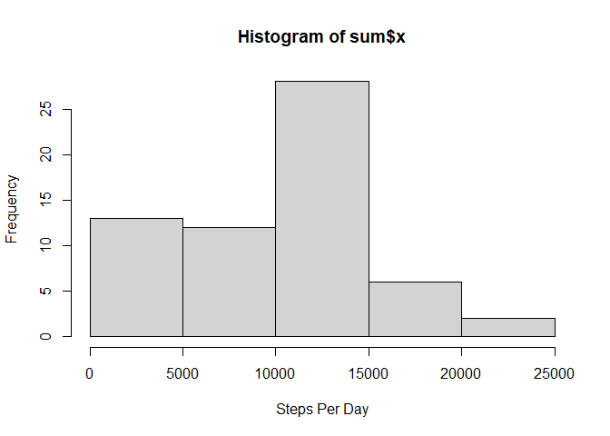
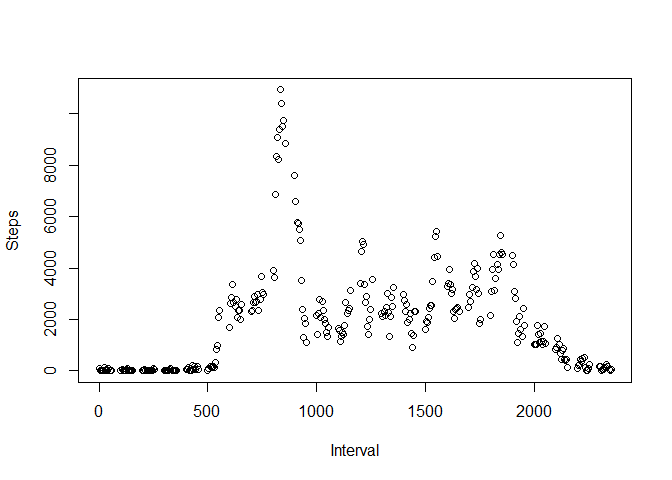
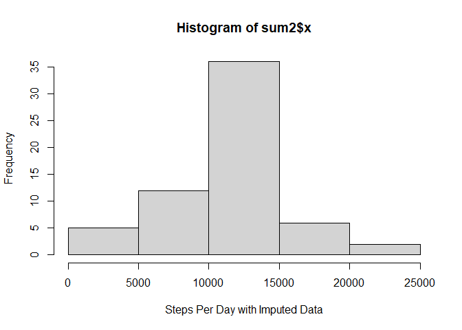
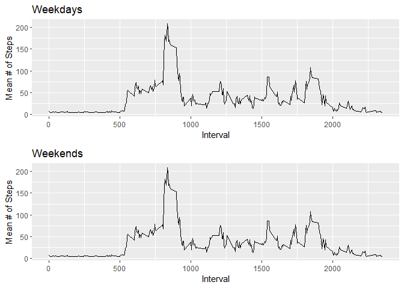

## Loading and preprocessing the data
### Load Data

```r
activity <- read.csv("activity.csv")
```

### Total Steps Per Day 

```r
sum <- aggregate(x = activity$steps,   #data   
          by = list(activity$date),    #grouping          
          FUN = sum, na.rm = TRUE)    #ignore missing values
```

### Histogram of Steps Per Day 

```r
hist(sum$x, xlab = "Steps Per Day")
```

<!-- -->


## What is mean total number of steps taken per day?

```r
mean <- mean(sum$x, na.rm = TRUE)   #ignore missing values
mean
```

```
## [1] 9354.23
```

```r
median <- median(sum$x, na.rm = TRUE) #ignore missing values 
median
```

```
## [1] 10395
```

## What is the average daily activity pattern?

```r
maxtime <- aggregate(x = activity$steps,   #data   
          by = list(activity$interval),    #grouping          
          FUN = sum, na.rm = TRUE)
```
### Time Series Daily Activity 

```r
plot(maxtime, xlab = "Interval", ylab = "Steps")
```

<!-- -->

### Interval with Most Steps on Average 

```r
t <- which.max(maxtime$x)       #row with maximum 
maxtime$Group.1[t]              #interval in relation to max row 
```

```
## [1] 835
```


## Imputing missing values

```r
library(tidyr)        #import tidyr to use replace_na
```

```
## Warning: package 'tidyr' was built under R version 4.0.4
```

```r
imputed <- replace_na(activity, 
          list(steps = mean(activity$steps,  #replace NA in steps
                       na.rm = TRUE)))      #with the mean for steps
```

## Total Steps Per Day with Imputed Data

```r
sum2 <- aggregate(x = imputed$steps,   #data   
          by = list(imputed$date),    #grouping          
          FUN = sum, na.rm = TRUE)    #ignore missing values
```

### Histogram of Steps Per Day with Imputed Data

```r
hist(sum2$x, xlab = "Steps Per Day with Imputed Data")
```

<!-- -->

### Mean and Median with Imputed Data 

```r
mean2 <- mean(sum2$x, na.rm = TRUE)   #ignore missing values
mean2
```

```
## [1] 10766.19
```

```r
median2 <- median(sum2$x, na.rm = TRUE) #ignore missing values 
median2
```

```
## [1] 10766.19
```
#### Do these values differ from the estimates from the first part of the assignment? What is the impact of imputing missing data on the estimates of the total daily number of steps?

The first part of the assignment, when missing values were ignored the mean was 9354.2295082 and the median was 10395. After computing the missing values the mean was 1.0766189\times 10^{4} and the median was 1.0766189\times 10^{4}.
The mean was increased by approximately 1000 steps when the missing values were filled in, however, the median changed by less than 400 steps.


## Are there differences in activity patterns between weekdays and weekends?
Weekdays package required date change, is.weekend works with current date format.

```r
library(lubridate)
```

```
## Warning: package 'lubridate' was built under R version 4.0.4
```

```
## 
## Attaching package: 'lubridate'
```

```
## The following objects are masked from 'package:base':
## 
##     date, intersect, setdiff, union
```

```r
library(chron)
```

```
## Warning: package 'chron' was built under R version 4.0.4
```

```
## 
## Attaching package: 'chron'
```

```
## The following objects are masked from 'package:lubridate':
## 
##     days, hours, minutes, seconds, years
```

```r
imputed$day <- as.factor(is.weekend(imputed$date))
levels(imputed$day) <- c("weekday","weekend")
summary(imputed)
```

```
##      steps            date              interval           day       
##  Min.   :  0.00   Length:17568       Min.   :   0.0   weekday:12960  
##  1st Qu.:  0.00   Class :character   1st Qu.: 588.8   weekend: 4608  
##  Median :  0.00   Mode  :character   Median :1177.5                  
##  Mean   : 37.38                      Mean   :1177.5                  
##  3rd Qu.: 37.38                      3rd Qu.:1766.2                  
##  Max.   :806.00                      Max.   :2355.0
```


```r
library(ggplot2)
```

```
## Warning: package 'ggplot2' was built under R version 4.0.4
```

```r
library(dplyr)
```

```
## Warning: package 'dplyr' was built under R version 4.0.4
```

```
## 
## Attaching package: 'dplyr'
```

```
## The following objects are masked from 'package:stats':
## 
##     filter, lag
```

```
## The following objects are masked from 'package:base':
## 
##     intersect, setdiff, setequal, union
```

```r
weekdays <- filter(imputed, day == "weekday")
weekday_intervals <- na.exclude(group_by(weekdays, interval))
weekday_intervals <- summarise(weekday_intervals, Mean = mean(steps))
weekday_plot <- ggplot(weekday_intervals, aes(interval, Mean)) + geom_line() + labs(x = "Interval", y = "Mean # of Steps", title = "Weekdays")

weekends <- filter(imputed, day == "weekend")
weekend_intervals <- na.exclude(group_by(weekends, interval))
weekend_intervals <- summarise(weekend_intervals, Mean = mean(steps))
weekend_plot <- ggplot(weekday_intervals, aes(interval, Mean)) + geom_line() + labs(x = "Interval", y = "Mean # of Steps", title = "Weekends")

library(cowplot)
```

```
## Warning: package 'cowplot' was built under R version 4.0.4
```

```
## 
## Attaching package: 'cowplot'
```

```
## The following object is masked from 'package:lubridate':
## 
##     stamp
```

```r
plot_grid(weekday_plot, weekend_plot, nrow = 2, ncol =1)
```

<!-- -->


